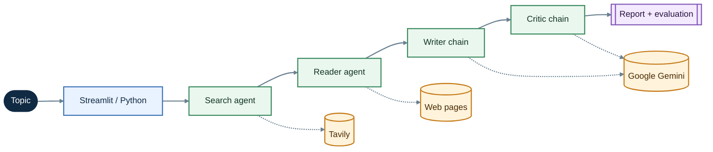

# Multi-agent LangChain Research System

An autonomous research assistant that searches the web, reads relevant sources, writes a structured research report, and evaluates the result. The project provides a Streamlit interface for interactive research and a Python pipeline for programmatic use.

> Research output depends on the quality and availability of external sources and should be reviewed before being used as authoritative material.

## At A Glance

| | |
| --- | --- |
| Interface | Streamlit web application |
| Model provider | Google Gemini via LangChain |
| Search provider | Tavily |
| Runtime | Python 3.11+ |
| Main output | Research report plus critic evaluation |

## Contents

- [Features](#features)
- [Architecture](#architecture)
- [Technologies](#technologies)
- [Installation](#installation)
- [Usage](#usage)
- [Project Structure](#project-structure)
- [Contributing](#contributing)
- [License](#license)

## Features

- Web search powered by Tavily, with up to five results per query.
- Source extraction with multiple fallbacks for article pages.
- Separate LangChain agents for searching and reading web content.
- Gemini-powered report writing and critical evaluation.
- Streamlit UI with report, evaluation, source, and scraped-content views.
- Downloadable research reports from the web interface.

## Architecture

The application has two entry points. `app.py` provides the interactive Streamlit experience, while `src/pipelines/pipelines.py` exposes a reusable Python function for automation. Both follow the same research workflow.



The main flow moves from a topic to search, reading, writing, and review. Dashed links show the external services used along the way.

<details>
<summary><strong>Pipeline stages</strong></summary>

1. **Search agent** calls the Tavily search tool and gathers candidate sources.
2. **Reader agent** uses the scraping tool to extract and summarize relevant content from those sources.
3. **Writer chain** combines the search results and extracted content into a report with an introduction, key findings, conclusion, and sources.
4. **Critic chain** reviews the report and returns a score, strengths, areas for improvement, and a one-line verdict.

</details>

<details>
<summary><strong>Pipeline return value</strong></summary>

The Python pipeline returns a dictionary with these keys:

| Key | Description |
| --- | --- |
| `search_results` | Search-agent response with candidate sources |
| `scraped_content` | Extracted and summarized source material |
| `research_report` | Generated report |
| `report_evaluation` | Critic score and feedback |

</details>

## Technologies

- **Python 3.11**
- **Streamlit** for the web interface
- **LangChain** and **LangChain Core** for agents, prompts, and chains
- **Google Gemini** through `langchain-google-genai`
- **Tavily** for web search
- **Requests**, **Trafilatura**, **Readability**, and **BeautifulSoup** for source extraction
- **python-dotenv** for local environment configuration

## Installation

### 1. Clone the repository

```bash
git clone <repository-url>
cd Multi-agent-Langchain-Research-System
```

> Replace `<repository-url>` with the URL of your fork or the upstream repository.

### 2. Create an environment

Using Conda:

```bash
conda create -n langagent python=3.11 -y
conda activate langagent
```

Or using a Python virtual environment:

```bash
python3.11 -m venv .venv
source .venv/bin/activate
```

### 3. Install dependencies

```bash
python -m pip install --upgrade pip
python -m pip install -r requirements.txt
```

### 4. Configure API keys

Create a `.env` file in the project root:

```dotenv
GOOGLE_API_KEY=your_google_api_key
TAVILY_API_KEY=your_tavily_api_key
```

The Google key is used by Gemini through LangChain. The Tavily key is used by the web-search tool. Do not commit `.env` or expose these keys publicly.

## Usage

### Streamlit application

Start the interactive research UI with:

```bash
streamlit run app.py
```

Enter a research topic in the app and start the pipeline. The interface displays the generated report, critic evaluation, scraped content, and search results.

The app is designed for an interactive loop: change the topic, inspect the generated report and evaluation, then download the report when it is ready for review.

### Python pipeline

The reusable pipeline can be called from Python:

```python
from src.pipelines.pipelines import run_research_pipeline

result = run_research_pipeline("Artificial Intelligence in Healthcare")
print(result["research_report"])
print(result["report_evaluation"])
```

The returned dictionary contains `search_results`, `scraped_content`, `research_report`, and `report_evaluation`.

## Project Structure

```text
.
├── app.py                  # Streamlit application
├── main.py                 # Simple pipeline entry point
├── requirements.txt        # Python dependencies
└── src/
	├── agents/             # Search and reader agents; writer and critic chains
	├── pipelines/          # End-to-end research orchestration
	└── tools/              # Tavily search and web scraping tools
```

## Contributing

1. Create a feature branch.
2. Keep changes focused and add tests for new behavior where practical.
3. Verify the application starts with `streamlit run app.py`.
4. Open a pull request describing the change and any configuration requirements.

## License

This project is distributed under the license in [LICENSE](LICENSE).